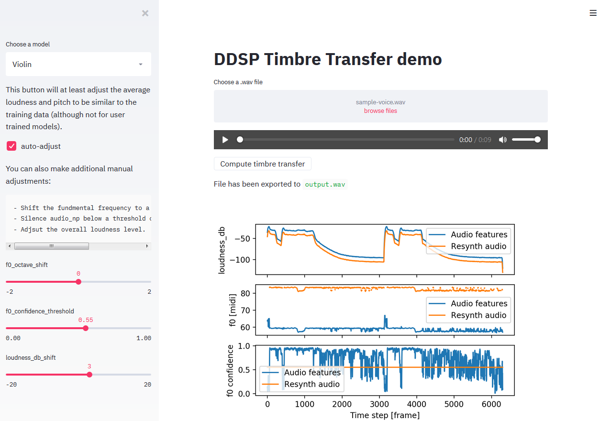

# DDSP demo on Streamlit

Streamlit version for the [DDSP timbre transfer demo](https://github.com/magenta/ddsp/blob/master/ddsp/colab/demos/timbre_transfer.ipynb) _but only for `.wav` files_.



## Prerequisites

- You need to download and unzip the DDSP checkpoints in the `models/` folder.

I did it using the `gsutil` tool in a Colab environment then downloading from Colab to local machine :

```bash
!gsutil cp -r gs://ddsp/models/ .
```

The structure should look like :

    ├── models
    │   ├── solo_flute_ckpt
    |   |   ├── model.ckpt-2400.data-00000-of-00001
    |   |   ├── model.ckpt-2400.index
    |   |   ├── model.ckpt-2400.meta
    |   │   └── operative_config-0.gin
    │   ├── solo_flute2_ckpt
    |   │   └── ...
    │   └── slow_violin_ckpt
    |       └── ...
    │
    ├── app.py
    │
    .
    .
    .

- You also need some `.wav` file to upload. There is no means to record your voice yet within Streamlit so do it beforehand, or download some free voice sample.

## Install

I use conda but feel free to use your own virtual env to install requirements.txt :

```bash
conda create -n ddsp-streamlit-ui python=3.7
conda activate ddsp-streamlit-ui
pip install -r requirements.txt
```

## Run

```bash
streamlit run app.py
```

At the end of script, the output file is created in `output.wav`.

## Contribute

To regenerate `requirements.txt` :

```shell
pip install pip-tools
pip-compile requirements.in
```

To format code :

```shell
pip install black reorder-python-imports
reorder-python-imports --application-directories=.
black app.py
```
